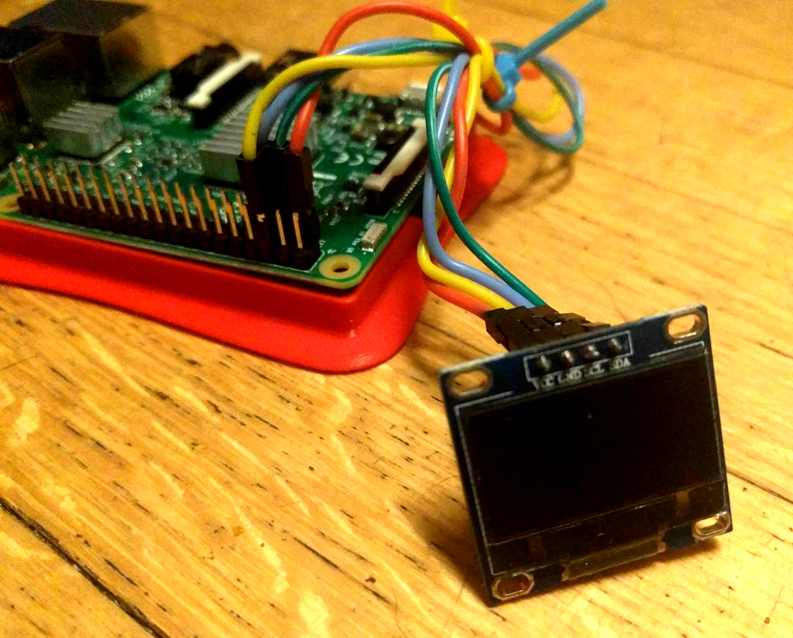
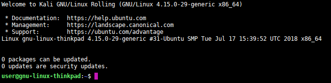

<!-- $theme: gaia -->

### Cybersecurity ==@ Yale Law School==

# 

##### 
###### Scott Shapiro | Sean O'Brien |  Laurin Weissinger

###### [yale.instructure.com/courses/38230](https://yale.instructure.com/courses/38230)

###### 
<!-- Creative Commons Attribution-ShareAlike -->

----
<!-- *template: gaia -->

# You All Have Laptops, Right?
### ...if for some reason you don't, please pair up with a new friend.

#### (You'll need your own next week!)

----

# ==Etherpad== for this class

[pad.riseup.net/p/yale-cyber-class01](https://pad.riseup.net/p/yale-cyber-class01)

* Etherpad is like a Google doc, no login required.

* This is an good place to share notes, questions, and thoughts during class.

* Don't put anything  private here, this is **security by obscurity** (anyone can guess the pad's URL).

* Please post in-depth discussions on [Canvas](https://yale.instructure.com/courses/38230).

* Reach out via [Wire](https://wire.com/en/download/) @yalecyber

----

<!-- *template: invert -->

### Our Approach

* Hands-on, practical learning
* Simple exercises to introduce complex concepts
* Cover a broad range of cybersecurity topics
* Break down conceptual barriers ("what is an operating system?")
* Free Software, Open Hardware
* There are **no magic bullets**!  Security takes time.
* Stay rooted in policy and law

----
<!-- *template: gaia -->

# Let's Dig In.

----
<!-- *template: invert -->

> Almost every principle of operating security is to think about vulnerability. Think about what the risks of compromise are and how to mitigate them.
>
> In every step, in every action, in every point involved, in every point of decision, you have to stop and reflect and think, 'What would be the impact if my adversary were aware of my activities?'

- Edward Snowden, [2015 interview](https://theintercept.com/2015/11/12/edward-snowden-explains-how-to-reclaim-your-privacy/)

----

## Operational Security (==OPSEC==)

* We're not going to dive into this deeply today, but try to conceive of your interactions with computers as a series of choices.
* Your network communication has **intermediaries** (e.g. your Internet Service Provider, Google, etc.)
* By the end of this class, your OPSEC will improve, simply by understanding the technology underlying your interactions better.
* Topics like encryption and anonymity cross into [**Digital Self-Defense**](https://privacylab.yale.edu) territory.

----
<!-- *template: invert -->

## Command Line Interface (==CLI==)

----

## What's the "==Command Line=="?

* Exactly what it sounds like. You enter commands, line-by-line.

* CLIs are text-based environments.

* In modern operating systems like ==macOS== and ==Ubuntu==, a **terminal emulator** usually accompanies the graphical user interface (GUI).
* You'll often hear the terms **shell**, **terminal**, and **command line** used interchangeably.
* ==`bash`== is the default Unix shell. More on this later.

----

## CLI for this Class: [hyper.is](https://hyper.is)

# 

* We chose Hyper for simplicity and compatibility across operating systems.

----

### Secure Shell (==SSH==) Protocol

* We'll connect to other computers via SSH.

* **Filezilla Client** -  [filezilla-project.org](https://filezilla-project.org)

* **Windows users only!** - Git [gitforwindows.org](https://gitforwindows.org)

# 

----

### Text Editor

* Every computer needs a good text editor :)

* **Atom** -  [atom.io](https://atom.io)

# 

----

<!-- *template: gaia -->

# Our Classroom Network

----

# 

----

## ==Raspberry Pi== is a mini-computer

# 

----

## ==Raspberry Pi== with a pretty case

# 

----

## ==Raspberry Pi== with an LED Display

# 

----

## ==Raspberry Pi== LED wiring

# 

----

<!-- *template: gaia -->

## Client / Server Model

# 

----

## Connect to an ==SSH Server==

* Open the ==Hyper== CLI.  Run: `ssh user@130.132.1.1`
* Type in the password `ThatWasEasy`
* Type `y` or `yes` to say you trust the connection
* Now, run the command `ls -lah`
* What do you see?

# 

----

## Create & Download a File

* Run: `touch ~/Desktop/CheckItOut.txt`
* Now, run the command `ls -lah`
* What do you see?
* Run: 

`scp user@130.132.1.1:/home/user/Patacsil_v_Google.pdf ~/`

* You just downloaded a PDF file from the server!

----

## So, What Just Happened?

You've used your SSH **client** to connect to a SSH **server**.  You can run commands on that machine!

You can run commands on a remote system, with no GUI necessary. A server with no GUI is "**headless**".

# 

----

<!-- *template: gaia -->

## Homework

----

**1.** Consider the case of Aaron Swartz ([_United_States v. Swartz_](https://en.wikipedia.org/wiki/United_States_v._Swartz)).  How does this relate to the activities from this class? The client / server model? Access to Knowledge?

**2.** CLIs are commonly called **terminals** for historical reasons. Why?

**3.** We can log into multiple **terminal sessions** at once, as different users or even the same user. Why has the software been designed this way?

**4.** Look up CLI command "cheat sheets". Identify **two commands** you want to learn more about.